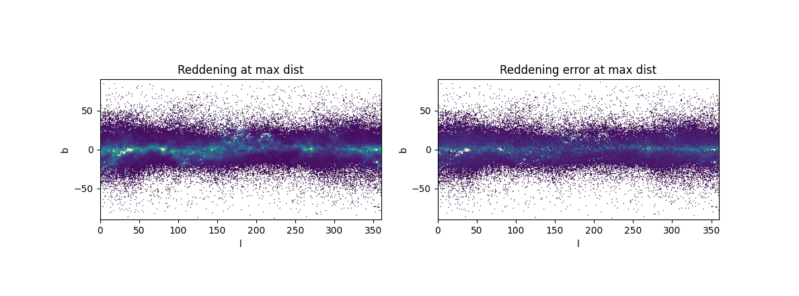

.. barbi-map documentation master file, created by
   sphinx-quickstart on Mon Jul 21 11:46:08 2025.
   You can adapt this file completely to your liking, but it should at least
   contain the root `toctree` directive.

barbi-map documentation
*********

This is the (very short) documentation for the resulting cumulative map as derived by YGK with Barbillon's data.
Some short explanations are tests are shown as well as an example on how to use it. 

:doc:`mypages/how_works`

:doc:`mypages/how_to_use`

The map is provided **as it is** and some caution should be taken depending on what science you do, as there are
many limitations associated to it. Mainly:

#. There are many **holes** in the map, where no stars have been detected. Mainly above and below the galactic plane (approx. :math:`|b-90| \geq 30` at max distance)

#. There are few stars in general (around 1 to 2 million, as opposed to 500 million in Bayestar), so the uncertainties are high.

.. toctree::
   :maxdepth: 2
   :caption: Contents:

.. autosummary::
   calc_ext
   cumulative_ext_vaex

