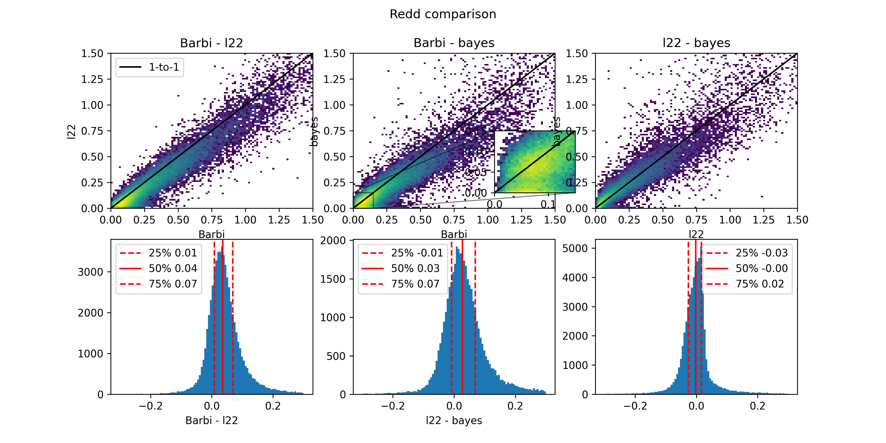

How to use it?
***********

Generating an extinction and reddening map
==========================================
To do this, you need a fits file that contains, at least, the galactic position and 
distance, as well as reddening and extinction. All of them with uncertainties.
The naming convention should be :code:`l`, :code:`b`, :code:`dist`, :code:`E_bprp`, :code:`Ag`,
and underscripted with :code:`_err`, the corresponding uncertainties (e.g., :code:`dist_err`).

Next, instantiate from the file or import :code:`DiscretizeReddMapMC`:

.. code-block:: python 

    disc_map = DiscretizeReddMapMC(file_dir, outfile, 
                            rel_err_lim, 
                            n_bins_b, n_bins_l, n_bins_r, 
                            r_lim_min, r_lim, verbose=True)

Then, calculate the map speciying the number of MC iterations and save it (automatically in outfile):

.. code-block:: python 

    disc_map.calculate_map(100)
    disc_map.save_map()

Calculating extinction and reddening for stars
====================================================

To calculate reddening, the function :code:`get_redd_ext` should be imported from the module :code:`calc_ext`. Then, pass
the position and path for the previously generated map. For example:

.. code-block:: python

    red, ag, red_err, ag_err = get_redd_ext(l, b, dist, 'cumul_red_ag_barbillon.fits')

For D23's halo sample (6D), the comparison can be found below. Beware that there is a systematic shift of around 0.03.

