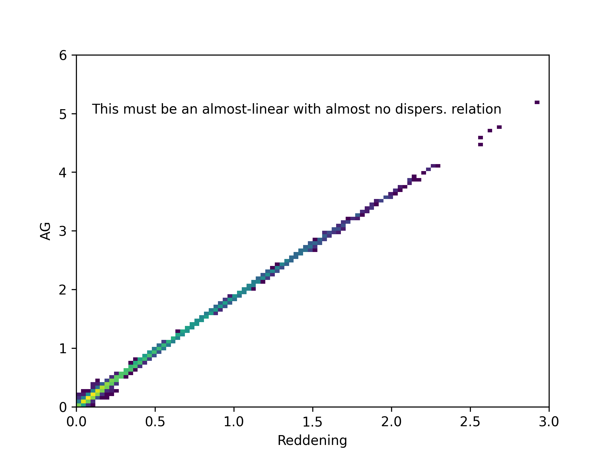

How is the map calculated? 
*************************
Example
=====

The map is calculated from the cumulative extinctions provided by Barbillon+2025 (in prep.). Since the number of stars
is low and the uncertainties in this regime hard to quantify, we employ a monte carlo approach that aims to simplify more complex
bayesian inference methods. We define the number monte carlo (MC) samples extracted will be denoted as :math:`N_\text{MC}`.

The recipe is:

#. Impose quality cuts for the relative error in reddening and extinction values (by default, a very relaxed 50%)

#. Extract :math:`N_\text{MC}` samples with distances, reddening, and extinction generated following a random sample :math:`\mathcal{N}(x, \sigma(x))`  where :math:`x` and :math:`\sigma(x)` are the value provided for each variable and  :math:`\sigma(x)` the error

#. Spatially bin in galactic coordiantes, :math:`l,b` and distance with a maximum distance (2.5 kpc by default). Then, perform both mean and standard deviations of values in each bin for reddening and extinction. These will be the associated values and uncertainties for each bin.

Note in step 2. that reddening and extinction are not indep. variables, so individual results for stars should not be used with this approach. In the end,
when comparing individual values for each bin, the relation is well recovered:

